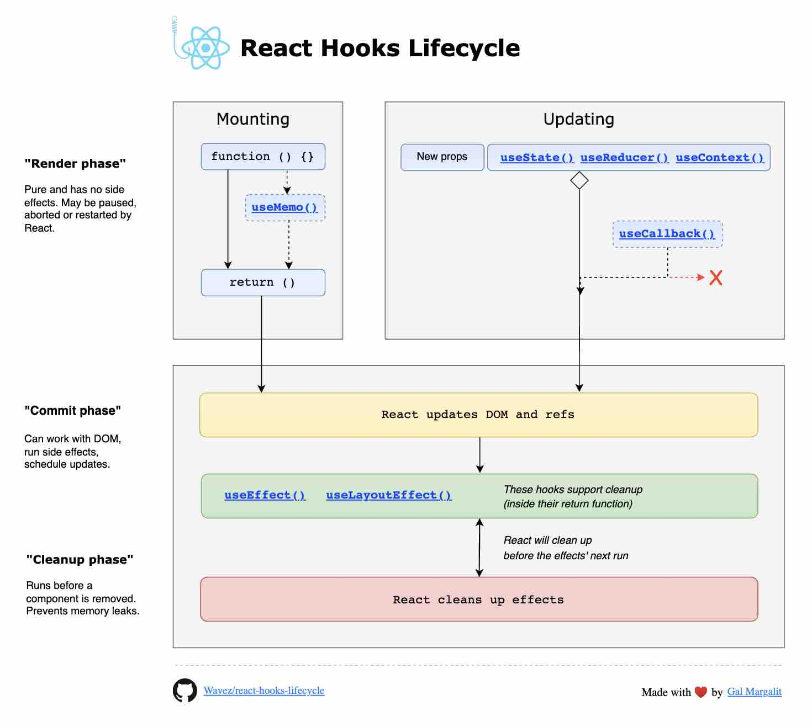

$$🪝ReactHooks$$
_Hooks are functions in React that let function components use state, side effects, and other React features without using class components._

> Hooks were introduced to solve problems with classes—poor logic reuse, tangled lifecycle methods, and confusing this behavior—while aligning React with functional programming and making code more predictable and reusable.

**useState** : _gives React a value to remember and a way to trigger re-renders safely._

- State is preserved across renders
- Updating state triggers re-render
  - local state
  - state liftup

**useEffect** : _Run this effect when these values change_

- DOM syncing after paint
- Effects do not run during render
- Effects are synchronized to dependencies, not lifecycles
  - fetching data
  - Subscriptions / cleanup
  - timeinterval/setTimeout

**useEffectEvent**: lets you separate events from Effects.
  const onEvent = useEffectEvent(callback)

**useContext**: _centralised state and Use it for global-ish data, not high-frequency updates_

- Shares state and functions across the tree
- Re-renders consumers when context value changes
- comman functionality

**useRef**: _A box React ignores during rendering._

- Holds a mutable value that does not cause re-renders
- direct control of dom
- Persisting values across renders
- modal conctrol
- Parent access requires forwardRef
- use ImprativeHandel to acceable in child components

**useMemo**

- Memoizes a computed value & Prevents expensive recalculation

**useCallback**

- cache a function definition between re-renders.
- Prevents unnecessary child re-renders
- Stabilizes dependencies in useEffect
  > Every render recreates functions.
  >
  > - a parent component that re-renders often (state, timer, input, animation)
  > - a child component that is memoized (React.memo)
  > - and you pass a function as a prop

$$useCase$$

- [x] Event handlers shared across systems
- [x] Callbacks registered once but used many times
- [x] Control signals passed to long-lived observers
- [x] Functions used as dependencies in reactive systems
- [x] APIs that rely on identity stability, not value comparison

**useReducer**

- State management via actions + reducer
- Predictable state transitions, not simpler state.

**useActionState**

- use form actions
- give state and action function with error status
- can be used for async/await
  - `const [state, formAction, isPending] = useActionState(fn, initialState, permalink?);`

**useId**

- Generates stable, unique IDs
- Works with SSR + hydration
- Avoids hydration mismatch

**useOptimistic**

- Enables optimistic UI updates
- UI updates before server confirms
- Assume success, rollback on failure.

**useLayoutEfect**

- Like useEffect, but runs before paint
- Measuring layout
- Preventing visual flicker
- Synchronous DOM reads/writes

# hook use case

### `useState`
- Toggle show/hide
- Controlled input value
- Counter
- Active tab index
- Boolean flag (isOpen, isLoggedIn)
- Error message string

---

### `useEffect`
- Fetch data on mount
- Set document title
- Subscribe / unsubscribe (websocket, event listener)
- Start a timer, clear on unmount
- Sync state to localStorage

---

### `useReducer`
- Multi-step form wizard
- Shopping cart (add, remove, update quantity)
- Async state machine (idle → loading → success → error)
- Undo / redo history
- Any state with 3+ related actions

---

### `useContext`
- Current logged-in user
- Theme (dark / light)
- Language / locale
- Feature flags
- Global notification system

---

### `useRef`
- Focus an input programmatically
- Store previous value without re-render
- Hold interval / timeout id
- Measure DOM element size
- Skip first `useEffect` run

---

### `useMemo`
- Filter a large list
- Sort a table
- Expensive math calculation
- Derived value from props or state
- Avoid re-computing on every render

---

### `useCallback`
- Stable handler passed to a child component
- Function used as a `useEffect` dependency
- Event handler attached via `addEventListener`

---

### `memo`
- Pure display component (avatar, badge, icon)
- List row that never changes
- Header / sidebar that re-renders unnecessarily

---

### `useImperativeHandle`
- Expose `focus()` / `clear()` from a custom input
- Expose `open()` / `close()` from a custom modal
- Expose `reset()` from a custom form component
- Any child method the parent needs to call directly

---

### `useTransition`
- Tab switch with heavy content
- Client-side route change
- Sorting / filtering a large dataset
- Any non-urgent state update that should not block typing

---

### `useDeferredValue`
- Search input with expensive results list
- Live markdown / code preview
- Autocomplete suggestions
- Real-time filter where input must stay responsive

---

### `useOptimistic`
- Like / unlike a post
- Add to cart
- Follow / unfollow
- Delete list item
- Any mutation that should feel instant before server confirms

---

### `useActionState`
- Form submit with server action
- Track server-returned error per field
- Show pending state during form submission
- Reset form after server success

---

### `useRef` vs `useState` — most asked interview comparison

| | `useRef` | `useState` |
|---|---|---|
| Triggers re-render | ❌ No | ✅ Yes |
| Persists across renders | ✅ Yes | ✅ Yes |
| Use for | DOM, timers, silent values | UI that must update |

---

### `useMemo` vs `useCallback` — most asked interview comparison

| | `useMemo` | `useCallback` |
|---|---|---|
| Memoizes | a **value** | a **function** |
| Returns | computed result | stable function reference |
| Use for | expensive calculations | stable handlers for children |

### `useDeferredValue`
- Typing in a search box
- Filtering a large list while user types
- Live preview (markdown, code editor)
- Autocomplete / typeahead suggestions
- Real-time data visualization updates
- Any input where new value is expensive to render

---

### `useTransition`
- Switching tabs
- Client-side route navigation
- Sorting a table
- Toggling a heavy chart or graph
- Accordion / collapsible panel with heavy content
- Paginating a large list (next/prev page)
- Switching themes when re-render is expensive

---

### `startTransition`
- Inside a router (Next.js, TanStack Router)
- Inside `setTimeout` / `setInterval`
- Inside a utility function outside a component
- Inside an event listener (`window.addEventListener`)
- Any place hooks are not allowed

---

### `useOptimistic`
- Like / unlike / upvote a post
- Add to cart
- Follow / unfollow a user
- Mark todo as done
- Delete a list item
- React to a message (emoji)
- Any mutation that should feel instant

---

### `use()` + `Suspense`
- Fetch user profile on page load
- Load a dashboard's data
- Streaming server component response
- Fetch dependent data (user → then their posts)
- Any promise you want React to unwrap declaratively

---

### `lazy()` + `Suspense`
- Lazy load a route/page component
- Lazy load a heavy modal
- Lazy load a chart library
- Lazy load admin-only sections
- Lazy load below-the-fold content

---

### `useState` + `useEffect` (classic fallback)
- Third-party async not compatible with Suspense
- Complex loading + error + retry logic
- Polling an endpoint every N seconds
- WebSocket / SSE data streams
- Any case where the above hooks don't fit

---

### Custom Hooks
- `useAsyncAction` → wraps `useTransition` + error state (reusable form submit)
- `useOptimisticList` → wraps `useOptimistic` for any list mutation
- `useDebouncedValue` → wraps `useDeferredValue` + setTimeout
- `usePagination` → wraps `useTransition` + page state
- `useServerAction` → wraps `useTransition` + `useOptimistic` together