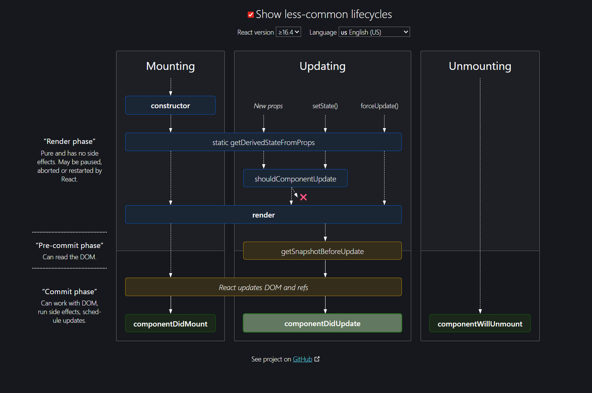

$$ReactComponentLifeCycle$$

## Mounting
 - `constructor`
    - `getDerivedStateFromProps` (derive state from props before first render)
 - Render
    - Virtual DOM creation
    - Layout calculation (React calculates the UI tree and prepares the DOM changes)
    - (Hooks: `useState`, `useReducer`, `useMemo`, `useCallback`)
 - Commit Phase
    - Real DOM update and ref attachment
    - (Hooks: `useLayoutEffect` → runs before paint, `useEffect` → runs after paint for side effects)
 - [x] `componentDidMount` (invoked once after initial render; good for API calls, subscriptions, DOM manipulations)

## Updating
 - Triggered by `setState()`, new props, or `forceUpdate()`
    - `getDerivedStateFromProps` (sync state with new props)
        - `shouldComponentUpdate` (decides if render is needed)
        - NO side effects should run here
 - Render
    - Virtual DOM re-creation
    - Layout calculation (compute diffs, prepare updates)
    - `getSnapshotBeforeUpdate` (capture DOM info before actual DOM mutations)
    - (Hooks: `useState`, `useMemo`, `useCallback` recalculated if dependencies changed)
 - Commit Phase
    - Only update the changed nodes in the real DOM (reconciliation)
    - (Hooks: `useLayoutEffect` cleanup + re-run, `useEffect` cleanup + re-run)
 - [x] `componentDidUpdate` (runs after commit, used for side effects like network requests, analytics, DOM adjustments)

## Unmounting
  - Cleanup callback functions and subscriptions will be invoked
  - (Hooks: `useEffect` cleanup, `useLayoutEffect` cleanup)
 - [x] `componentWillUnmount` (last chance to clean resources, cancel timers, remove event listeners)